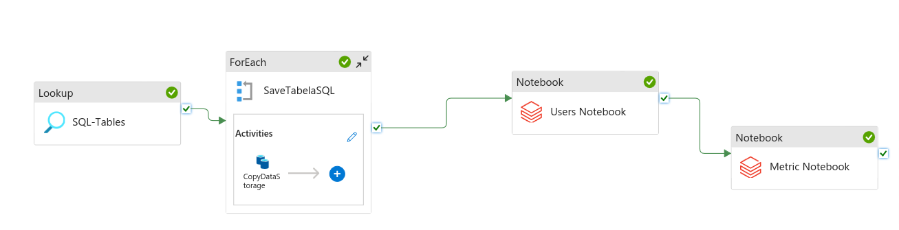

# AB Test Platform: A Comprehensive Guide

## 📘 Overview and Architecture

### 💼 Business Case

A/B testing is a core strategy for optimizing product features, user experiences, and business decisions. This platform provides a robust, cloud-native solution to manage A/B test execution and analysis at scale. Stakeholders such as product managers, data analysts, and marketing teams can monitor test progress, ensure statistical rigor, and identify the most effective variations using near real-time data and quality metrics.

With this automated pipeline, we enable:

* Reliable tracking of test lifecycle events (creation, start/end, variants, etc.)
* Centralized data storage and processing
* High-performance analytical queries on test results and metrics

### 🏗️ Architecture Overview

The project adopts a modular, scalable architecture leveraging Azure's core data services:

* **Data Ingestion**: Azure Data Factory copies A/B test metadata from the SQL Database and orchestrates pipeline execution.
* **Data Processing**: Azure Databricks performs ETL, transforming raw operational and event data into analytics-ready layers.
* **Data Storage**: Azure Data Lake Storage organizes data into bronze, silver, and gold layers.
* **Data Analysis**: Azure Synapse Analytics provides SQL-based access to final datasets for business analysis and reporting.

Optional visualization can be achieved through Power BI dashboards connected to Synapse.

---

## 🗃️ Data Modeling

The platform applies the **medallion architecture** to structure data into progressive layers:

* **Bronze Layer**: Raw platform and business events captured as-is from source systems.
* **Silver Layer**: Cleaned, filtered data focused on user behavior and interaction data.
* **Gold Layer**: Aggregated metrics including:

  * **Quality Metric**: Measures of test validity, such as sample size, bounce rate, etc.
  * **Business Metric**: Results like conversion rates, revenue impact, retention improvement, etc.

This layered approach enables both flexible reprocessing and reliable final insights.

---

## 🌐 Understanding the Data Sources

* **SQL Database**: Stores all operational metadata related to tests—creators, status, start/end dates, number of variants.
* **Platform Events**: Track user interactions with the test feature.
* **Business Events**: Measure downstream effects related to test goals.

These data sources are automatically pulled into the Data Lake and transformed in Databricks.

---

## 🎯 Key Benefits

* **Automation**: The entire pipeline is orchestrated through Data Factory—minimizing manual effort.
* **Scalability**: Built on Azure’s cloud-native services to support enterprise-scale test platforms.
* **Data Quality**: Organized, cleaned, and validated layers ensure consistent analysis.
* **Actionable Insights**: Deliver business and statistical metrics to stakeholders for decision-making.

---

## ⚙️ Deployment Guide

### Step 1: Create an Azure Account

* Sign up for an Azure account if you do not already have one.

### Step 2: Create a Databricks Resource

* Create a Databricks resource in Azure.
* Select the **Standard LTS (Long Term Support)** tier. Avoid using ML or other specialized tiers.

### Step 3: Set Up a Storage Account

* Create a Storage Account and enable **hierarchical namespaces** in the advanced settings.
* Navigate to the Storage Account resource:

  * Go to **Data Storage > Containers > + Containers**.
  * Create containers.
* Configure access:

  * Go to **IAM > Add role assignment > Storage Blob Data Contributor**.
  * Click **Next > Managed Identity > Select Members**.
  * Select **Access Connector for Azure Databricks** as the managed identity.
  * Click **Review + Assign**.

### Step 4: Configure Databricks

* Open the Databricks resource and click **Launch Workspace**.
* Start a compute instance (this may take a few minutes).
* Set up external data access:

  * Go to **Catalog > External Data > Credentials > Create Credential**.
  * For the **Access Connector ID**, use the **Resource ID** of the Access Connector:

    * Search for Access Connector, copy the Resource ID, and paste it here.
* Define external locations:

  * Navigate to **External Data > External Locations**.
  * Assign a name, select the storage credential, and specify the URL (use the container name and storage account name for `bronze`, `silver`, and `gold`).

### Step 5: Create a SQL Server and SQL Database

- In the Azure portal, create a **SQL Server**.
  - Choose a unique server name, set admin login and password, and select a region.
- Create a **SQL Database** under this server.
  - Select the basic pricing tier unless you expect large volumes of test metadata.
- Configure firewall rules:
  - Allow Azure services to access the server.
  - Add your client IP address if needed for manual access.
- This database will store all A/B test metadata, such as test names, variants, creation dates, and status.

### Step 6: Create Tables and Insert Data

- **Create Tables**:
  1. In the Azure portal, go to your **SQL Database** resource.
  2. Under **Settings**, click on **Query editor (preview)**.
  3. Sign in with your admin credentials.
  4. Once logged in, open the **`create`** SQL scripts from the `sqldatabase/create` folder. You can either copy-paste or upload the `.sql` files into the query editor.
  5. Execute the queries to create the necessary tables.

- **Insert Data**:
  1. After creating the tables, you can insert sample data by using the **`insert`** SQL scripts located in the `sqldatabase/insert` folder.
  2. Open the appropriate SQL files in the query editor.
  3. Execute the insert queries to populate the tables with test data.

### Step 7: Set Up Azure Data Factory (ADF)

1. **Create a Data Factory Resource**:
   - In the Azure portal, search for **Azure Data Factory** and click **Create**.
   - Fill in the necessary fields such as subscription, resource group, and region.
   - Once created, navigate to the **Data Factory** resource.

2. **Create a Linked Service**:
   - In the ADF portal, go to the **Manage** tab, then click on **Linked Services**.
   - Create a new linked service for both:
     - **SQL Database**: This will allow Data Factory to connect to the SQL Database for data extraction.
     - **Azure Databricks**: Set up a linked service to allow Data Factory to trigger Databricks notebooks for processing.
   - Configure the connection details (server name, database name, authentication method, etc.).

3. **Create a Pipeline**:
   - Go to the **Author** tab in ADF and create a new pipeline.
   - This pipeline will orchestrate the data movement and processing. You can:
     - Add a **Copy Data** activity to transfer data from the SQL Database to the Data Lake (bronze layer).
     - Add a **Databricks Notebook** activity to run the Databricks notebooks for further transformation and processing of the data.

4. **Configure Triggers**:
   - Set up triggers to automate the pipeline execution based on your desired schedule or event.
   - You can choose from **Schedule**, **Event-based**, or **Manual** triggers.

5. **Publish and Run**:
   - Once the pipeline is created and configured, publish your changes and run the pipeline to ensure everything is working as expected.

### Step 8: Create Notebooks

- Open your **Azure Databricks Workspace** and create a new folder to organize your notebooks (e.g., `/abtest-pipeline`).

- Create the necessary notebooks to process the data through the different layers of the Data Lake:

  1. **Ingestion Notebook**  
     - Reads raw data from the bronze layer.
     - Applies initial parsing and saves to the silver layer.

  2. **Transformation Notebook**  
     - Cleans and structures the silver layer data.
     - Applies business rules and saves enriched data to the gold layer.

  3. **Metrics Notebook**  
     - Calculates quality and business metrics.
     - Prepares final tables for reporting and analysis in Synapse.

- Store the notebooks in the `notebooks/` folder of your GitHub repository.

- Make sure each notebook has clear markdown cells explaining what it does, expected inputs, and outputs.

- These notebooks will be called from your Data Factory pipeline to process the data automatically.

### Step 9: Orchestrate the Pipeline in Azure Data Factory

- In this step, we bring together all components using a centralized Data Factory pipeline.

- **Pipeline Overview**:
  - The pipeline is responsible for:
    - Copying data from the SQL Database to the bronze container.
    - Triggering Databricks notebooks to process data through silver and gold layers.
    - Optionally triggering downstream processes such as metric aggregation or external alerts.

- **Visual Overview**:
  
  

- **Best Practices**:
  - Use parameters in your pipeline to handle different environments (e.g., dev, prod).
  - Add failure alerts and logging to monitor execution.
  - Schedule the pipeline or configure event-based triggers as needed.

This orchestration ensures a smooth, automated flow of data across all layers of the platform.

### Step 10: Integrate Azure Synapse Analytics

- **Create a Synapse Workspace**:
  - Link it to the existing Storage Account.
  - Configure a file system and assign necessary permissions.

- **Query Data Using Serverless SQL**:
  - Use `OPENROWSET` to query Parquet files stored in the the containers.

- **Create External Tables**:
  - Define external tables over the container to allow structured and reusable SQL queries.

- **Optimize Performance**:
  - Use partitioning, caching, or indexing techniques as needed to improve query speed and efficiency.

---

### Step 11: Visualization Options

- While **Power BI** is commonly used for dashboarding, it may not be ideal for macOS users.
- Consider running analysis directly within Synapse SQL for faster iterations and SQL-based exploration.
- You can also export the final gold-layer data to other visualization tools or notebooks as needed.

